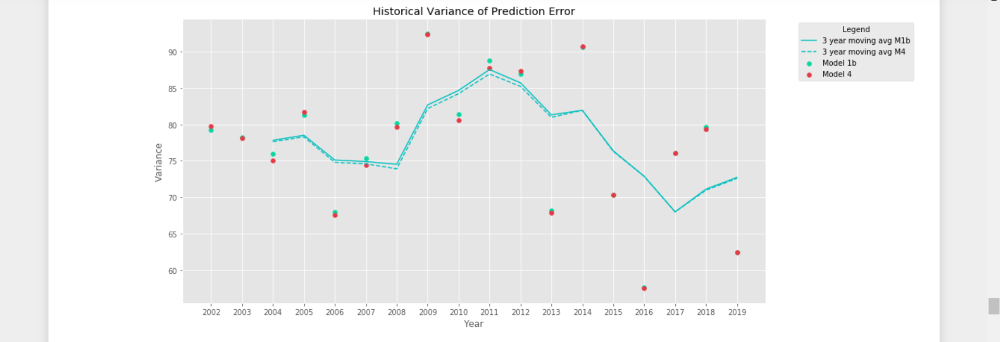
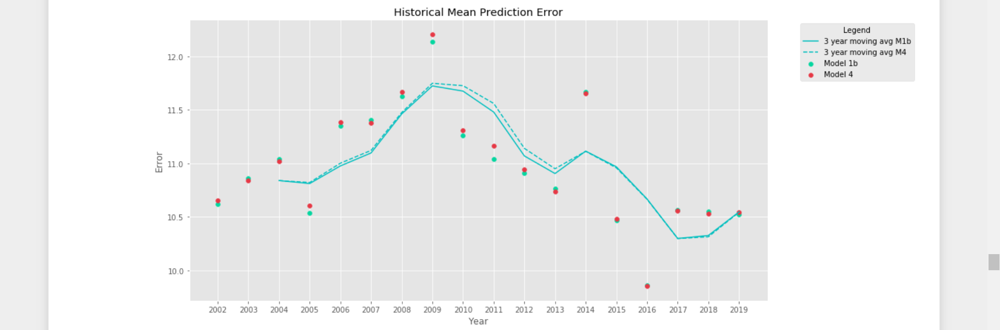
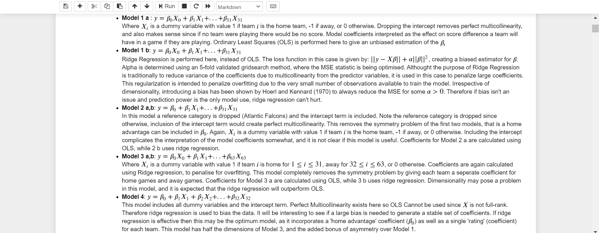
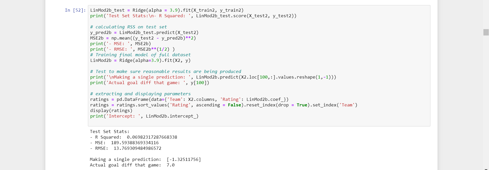
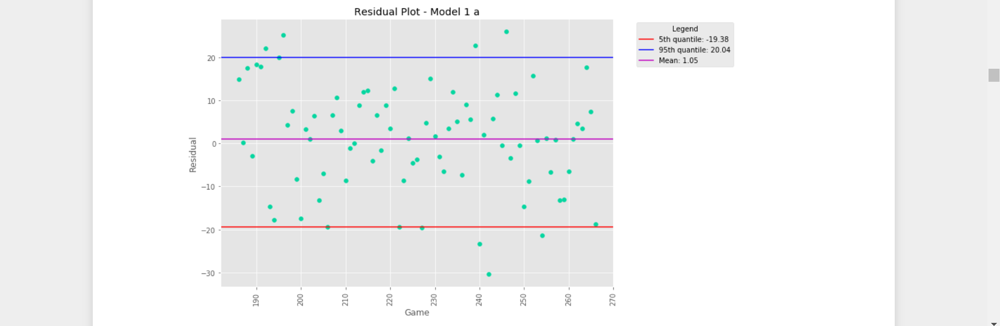
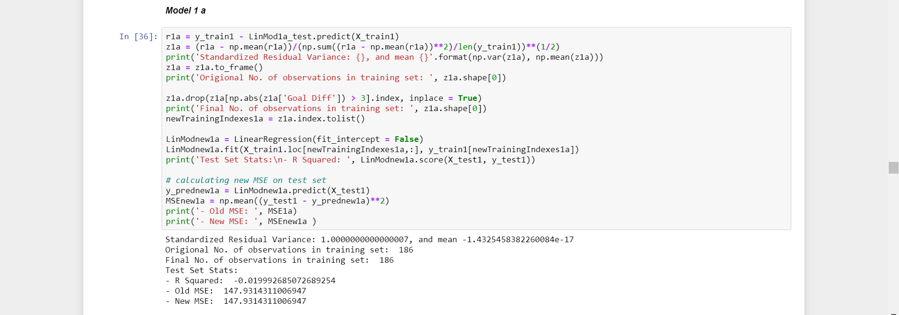
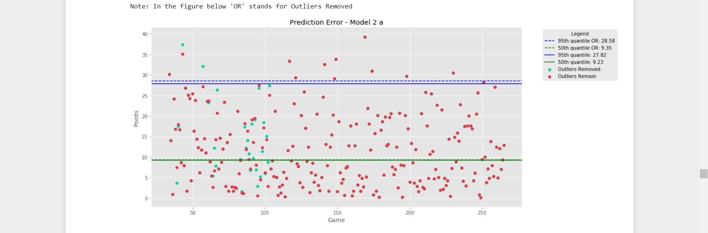

# NFL SCORE MODELLING 
### Aaron Tracey - Michael Kerins - Rhys Willis

This project uses multiple linear regression to predict the score in NFL games, given all previous scores in that season. This is achieved by defining, diagnosing and testing a set of models. The models, and comments can be found in the file titled 'Prediction of NFL Scores Using Only Game Results'. Further analysis of the two models which showed the most potential can be found in 'Historical Analysis of Models 4 and 1b Performance'. The project underwent two iterations as our technical knowlege improved, the first rough iteration can be found in 'Model Iteration 1'. After completing this first model, a short evaluation was drafted ('Evaluation of Model Iteration 1') before upskilling and proceeding to the final version. 

The project is coded entirely in Python 3.8.5 using the Jupyter Notebook platform. Models are created using sklearn, with support from numpy and matplotlib.

The project is a collaborative effort between Aaron Tracey, Rhys Willis, and I. This repository is forked from the main project repository, and documents my contribution to the project (with the exception of 'Model Iteration 1', which was a collaborative effort).

The full project report can be found in the file titled 'Project Report'.

---

---

---

---

---

---

---

